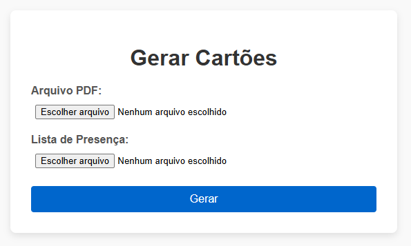

# 🪪 Gerador de Cartões Individuais

Este projeto foi desenvolvido utilizando **Django** e **Python**, com o objetivo de **gerar cartões de acesso individuais em PDF** a partir de um modelo e uma lista de presença.

---

## 📌 Objetivo

A aplicação permite que o usuário envie:

- Um arquivo **PDF** contendo o **modelo base** dos cartões (com 30, 40 ou 50 cartões por página).
- Um arquivo **TXT** com a **lista de presença**, contendo os nomes dos participantes (um por linha).

Com base nesses arquivos, a aplicação gera cartões individuais personalizados para cada nome da lista. Ao final do processo, os arquivos são compactados em um `.zip` e disponibilizados para download.

---

## 💻 Tecnologias Utilizadas

- Python 3.11+
- Django
- Django REST Framework
- HTML + CSS (formulário de upload)
- JavaScript (AJAX com fetch)

---

## 🚀 Como Executar o Projeto

### 1. Clone o repositório

```bash
git clone https://github.com/seu-usuario/seu-repo.git
cd seu-repo
```

### 2. Crie um ambiente virtual

```bash
python -m venv venv
source venv/bin/activate  # Linux/macOS
venv\Scripts\activate     # Windows
```

### 3. Instale as dependências

```bash
pip install -r requirements.txt
```

### 4. Rode as migrações

```bash
python manage.py migrate
```

### 5. Inicie o servidor

```bash
python manage.py runserver
```

Acesse `http://localhost:8000/upload/` para usar a interface web.

---

## 📂 Estrutura dos Arquivos

- `upload.html`: Interface para envio dos arquivos.
- `views.py`: Contém a lógica para processar os arquivos, gerar os cartões e responder com o `.zip`.
- `style.css`: Estilização simples do formulário.
- `services/gerar_cartoes_pdf.py`: Função responsável por gerar os arquivos a partir dos inputs.

---

## 📥 Formato dos Arquivos de Entrada

### 📄 Modelo PDF (arquivo base)

- Arquivo `.pdf` com o layout dos cartões em branco.
- Pode conter 30, 40 ou 50 cartões por página.

### 📄 Lista de Presença (nomes)

- Arquivo `.txt`
- Um nome por linha:

```
Ana Souza
Carlos Lima
Fernanda Alves
...
```

---

## ✅ Resultado

Após o envio dos arquivos, a aplicação:

1. Gera os cartões personalizados com os nomes.
2. Agrupa os cartões individuais.
3. Compacta todos em um `cartoes.zip`.
4. Exibe um botão para o usuário baixar o arquivo.

---

## 📸 Captura de Tela



---

## 🛠 Melhorias Futuras

- Upload de arquivos `.csv` com mais informações
- Opção de selecionar o layout (30, 40 ou 50 por página)
- Autenticação e histórico de downloads por usuário
- Suporte a múltiplos modelos de cartão

---

## 📄 Licença

Este projeto está sob a licença [MIT](LICENSE).

---

## 🙋‍♂️ Autor

Marcus Soares  
[LinkedIn](https://www.linkedin.com/in/seu-usuario) • [GitHub](https://github.com/seu-usuario)